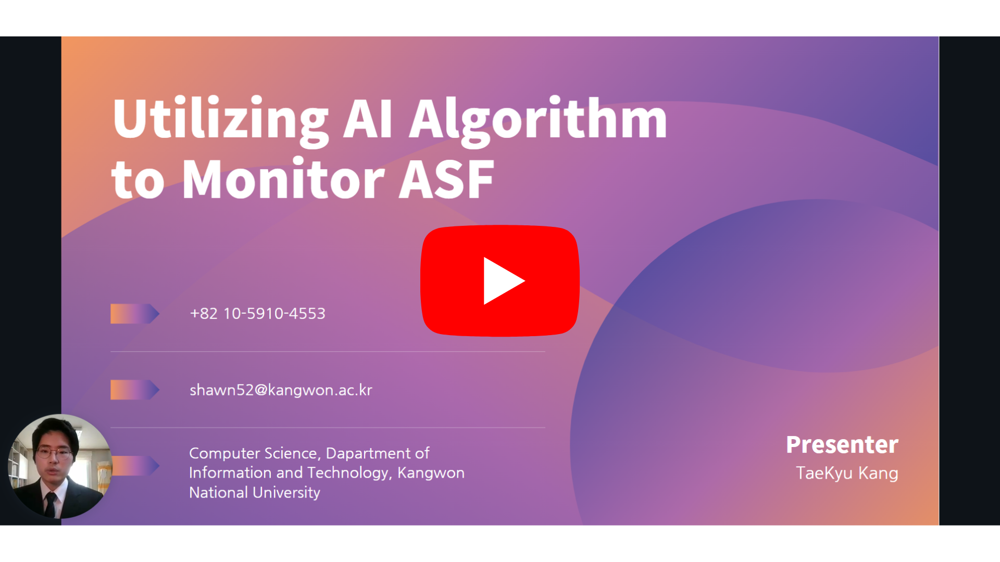
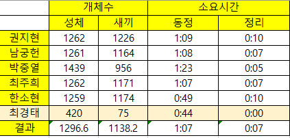
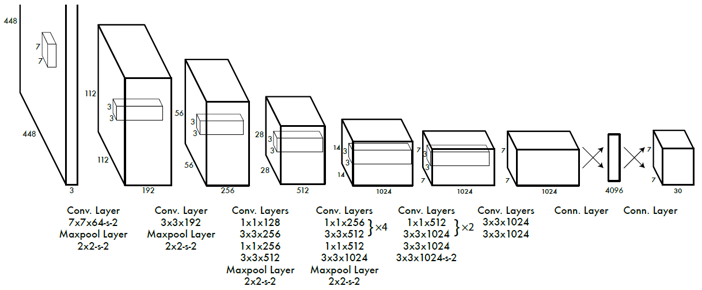
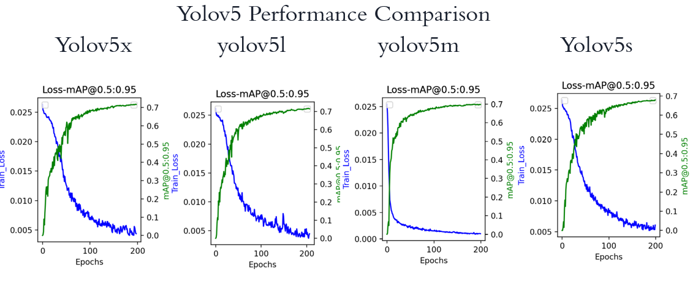
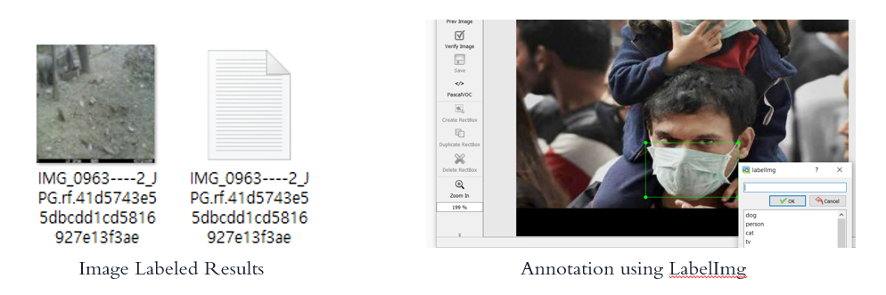
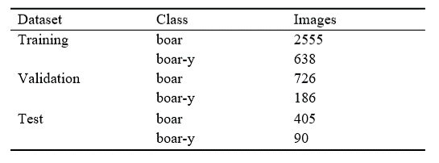

# Image Based Wild Boar Species Recognition using YOLOv5x 🐗

## What Is YOLOV5?

YOLOv5 is a family of object detection architectures and models pretrained on the COCO dataset, and represents Ultralytics open-source research into future vision AI methods, incorporating lessons learned and best practices evolved over thousands of hours of research and development(-ref. by Ultralytics).  

* Explanation Video KR @ https://www.youtube.com/watch?v=_OjmGL69u0E&t=1s (👈 Click!)
* Explanation Video ENG @ https://youtu.be/NPsgw3J9M0o (👈 Click!)

## Before Starting

This Google colaboratory doesn't support model training. Check out our latest repository of (www.link.com) for more details.
2
## What We Targert For?

This project aims for a low workforce, fast model training, and a cost-effective way to classify boar species. Final results are utilized for Forest and Environmental Industry.

## Research Motivation 

* ASF(African Swine Fever) conviction cases arose significantly lately and caused the agricultural sector an estimated billion dollars in damage.
* Human conventional methods are time expensive and caused amount of annotation mistakes.
* Contrast to previous methods, employing artificial intelligence is cost-effective, accurate, and fast in monitoring boar species.
* YOLO(You Only Look Once) has been popular for animal classification which fits well with our research.

## YOLO Architecture

* YOLO is composed of 24 convolutional layers and 2 fully connected layers. 
* Convolutional layers train datas based on filter, weight, and bias.
* Fully connected layers transfer 2d to 1d array which is used for classification results.

## Why YOLOv5x?

*  YOLOv5 is a leading and cutting edge technology for object detection.
*  YOLOv5x has higher MaP(Mean Average Precision) compare to YOLOv5s, YOLOv5m, and YOLOv5l. 

## Research & Experiment Roadmap

1. Label images
2. Split image datas into 3 sets(Training - 70%, Validation - 20%, Test - 10%)
3. Start model training with training dataset
4. Evaluate the model accuaracy 
5. Use model for future classification

## Image Labeling With Box Annotation

Used LabelImg, including multi-various tools for annotating tags.

## Spliting Image Datas

Data was separated to 70% of training set, 20% of validation set, and 10% of test set.

## Model Evaluation

* MaP(Mean Average Precision) is used for model evaluation and mearsurement.
* IOU(Intersection Over Union) is an evaluation metric used to measure accuracy of an object detector on a particular dataset.
* Recall is the number of relevant documents retrieved by a search divided by the total number of existing relevant documents.
* Precision is the number of relevant documents retrieved by a search divided by the total number of documents retrieved by that search.
* A precision-recall curve is a plot of the precision (y-axis) and the recall (x-axis) for different thresholds, much like the ROC curve.

## Model Optimization & Improvment Method: Hyperparameter Tuning

* Hyperparameter tuning resolves overfitting issues and increases MaP scores.
* YOLOv5 has at least 32 hyperparameters which are used for model tuning. Slight hyperparameter combination in between values can improve the model significantly.
* Genetic Algorithm is used for searching hyperparameters effectively and increasing model accuracy.

## Data Sampling

* Data Sampling minimizes dataset scale that follows class ratio.
* Data sampling is used for Genetic Algorithm. It is a cost and time-effective way to find hyperparameters.

## How To Implement?

1. Save a copy of our Google colaboratory in google drive("File" - "Save a copy in drive").
2. Create file "YOLO"("/content/drive/My Drive/YOLO").
3. Upload Detect.py(Revised Detect.py), best_original.pt(Pre-trained model), and "멧돼지데이터.zip(Boar image dataset)" in file "YOLO". 
4. Start Google colaboratory by "Run All('Runtime' - 'Run All')".

* See demo @ https://b-flask.shawngitman.repl.co/try (👈 Click!)
* Download Detect.py @ https://drive.google.com/file/d/1mu2oaFDp3LWH-CfvfAsC6XzmhT_O0xDJ/view?usp=sharing
* Download best_original.pt @ https://drive.google.com/file/d/1mNi-fPa6vP_aNYI6BSaP_rPfx_X53oAO/view?usp=sharing

## How Can I Download The Results?

Download "/content/res.zip"

## Where Should I Contact?

* 24/7 anytime reach us to taegue52@daum.net, Taekyu Kang
* Source available @ https://github.com/Shawn-gitman/Boar_Classification_Yolov5
* Latest source available @ https://colab.research.google.com/drive/1srx0xl4lk-GyL9jiCvrVUU3dmfHh4SJu?usp=sharing

## Dependencies

* Cython
* matplotlib
* numpy
* opencv-python
* Pillow
* PyYAML
* scipy
* tensorboard
* torch
* torchvision
* tqdm
* seaborn
* pandas
* coremltools
* vonnx>=1.8.1
* scikit-learn
* thop
* pycocotools>=2.0

## Reference

* Ultralytics
* Roboflowai
* https://pyimagesearch.com/2016/11/07/intersection-over-union-iou-for-object-detection/
* https://en.wikipedia.org/wiki/Precision_and_recall#:~:text=Recall%20is%20the%20number%20of,documents%20retrieved%20by%20that%20search.
* https://machinelearningmastery.com/roc-curves-and-precision-recall-curves-for-classification-in-python/#:~:text=A%20precision%2Drecall%20curve%20is,constant%20class%20in%20all%20cases.

## Update

* 2/12/2022 - Several bugs revised & Github pushed.
