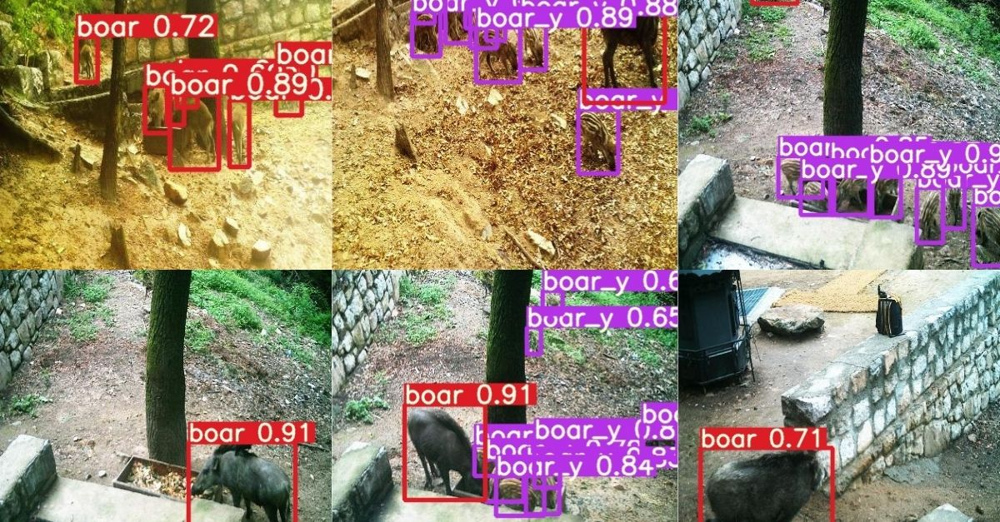

# Image Based Wild Boar Species Recognition using YOLOv5x 🐗

## ● What Is YOLOV5?

YOLOv5 is a family of object detection architectures and models pretrained on the COCO dataset, and represents Ultralytics open-source research into future vision AI methods, incorporating lessons learned and best practices evolved over thousands of hours of research and development(-ref. by Ultralytics).  

* Explanation Video KR @ https://www.youtube.com/watch?v=_OjmGL69u0E&t=1s (👈 Click!)

## ● Before Starting

* This Google colaboratory doesn't support model training. Check out our latest repository of (link) for more details.

## ● KNU Capstone Design Competitive Exhibition - The First Prize

* We've joined KNU Capstone Design Competitive Exhibition & Won the First Prize. Our Team introduced wild boar identification model's business suitability and efficiency.

## ● What We Targert For?

* We aim for low workforce, fast model training, and cost effective way to classify boar species. Final results are utilized for Forest and Environmental Industry to compare the work performance between AI and a human being. 

## ● How To Implement?

1. Save a copy of our Google colaboratory in google drive("File" - "Save a copy in drive").
2. Create file "YOLO"("/content/drive/My Drive/YOLO").
3. Upload Detect.py(Revised Detect.py), best_original.pt(Pre-trained model), and "멧돼지데이터.zip(Boar image dataset)" in file "YOLO". 
4. Start Google colaboratory by "Run All('Runtime' - 'Run All')".

* See demo @ https://b-flask.shawngitman.repl.co/try (👈 Click!)
* Download Detect.py @ https://drive.google.com/file/d/1mu2oaFDp3LWH-CfvfAsC6XzmhT_O0xDJ/view?usp=sharing
* Download best_original.pt @ https://drive.google.com/file/d/1mNi-fPa6vP_aNYI6BSaP_rPfx_X53oAO/view?usp=sharing

## ● How Can I Download The Results?

* Download "/content/res.zip"

## ● Where Should I Contact?

* 24/7 anytime reach us to taegue52@daum.net, Taekyu Kang
* Source available @ https://github.com/Shawn-gitman/Boar_Classification_Yolov5
* Latest source available @ https://colab.research.google.com/drive/1srx0xl4lk-GyL9jiCvrVUU3dmfHh4SJu?usp=sharing

## ● Dependencies

* Cython
* matplotlib
* numpy
* opencv-python
* Pillow
* PyYAML
* scipy
* tensorboard
* torch
* torchvision
* tqdm
* seaborn
* pandas
* coremltools
* vonnx>=1.8.1
* scikit-learn
* thop
* pycocotools>=2.0

## ● Reference

* Ultralytics
* Roboflowai

## ● Update

* 2/12/2022 - Several bugs revised & Github pushed.
